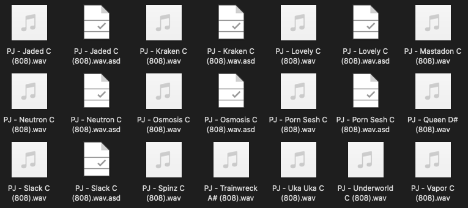
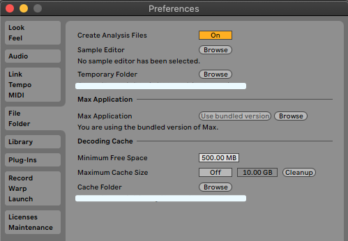
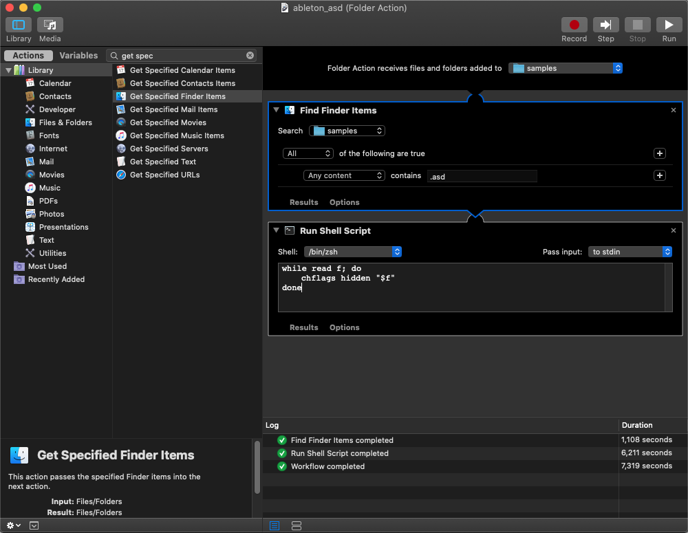

# What are ASD files?
> TLDR: .asd files speedup audio processing by storing Ableton metadata like tempo, warping, clip settings…

As an Ableton user, you might have experienced the automatic creation of an `.asd` file in your samples folder. In this article, we are going to explain what these files are and what they are for. We will then describe the different ways you can handle them.

<div align="center"><p><small><i>Ableton .asd files</i></small></p></div>


## What are ASD files
This is a special [Ableton file type](../ableton_file_types/README.md) used to speed up Ableton to processing. If you enable the option, it will generate an `.asd` file every time you import or record audio samples on Ableton, if an `.asd` file does not already exist. It contains various metadata of its related `.wav` file like tempo, warping points, clips settings. That avoids Ableton analysis process for the next time you are using this sample.

## How to handle them?
### Deleting analysis files
Analysis files are useful as they allow Ableton to be more efficient, you still can delete them if you are bothered by this automatic creation. This will not affect its related `.wav` file, but it means Ableton will analyse these files every time you use it inside a project.

### Disabling analysis files
As we have seen previously, `.asd` files are useful but not mandatory. Indeed, Ableton does provide a way to disable analysis files automatic creation through its preferences menu.

> Preferences → File/Folder → Create Analysis Files

<div align="center"><p><small><i>Analysis files setting</i></small></p></div>

### Hiding analysis files
If you want to keep `.asd` files creation but do not want to see them anymore, you can simply hide them.

#### On macOS
> Using command line

In order to hide `.asd` files on mac, you can run the following command:

- `chflags hidden <path_to_your_folder>/*.asd`

If you change your mind and want to revert the previous command, you can run the following:

- `chflags nohidden <path_to_your_folder>/*.asd`

> Using automator

To automate this process, you can use mac OS automator:

1. Create a new `Folder Action`
2. Add `Find Finder Items` and set it to search you samples folder, filtering files which extension is `.asd`
3. Add `Run Shell Script` with the following script

```
while read f; do
 chflags hidden "$f"
done
```

You can now run this automator script.

<div align="center"><p><small><i>macOS automator script</i></small></p></div>

#### On Windows
Unfortunately, as I do not own a Windows computer, I can not provide similar tips, but I still did find some interesting suggestions on the following [thread](https://forum.ableton.com/viewtopic.php?t=217627#p1789520). I did not have a chance to test it though, so please run those commands only if you know what you are doing.