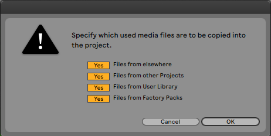
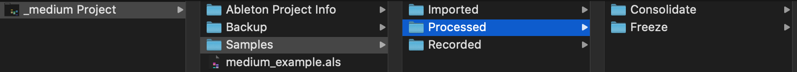
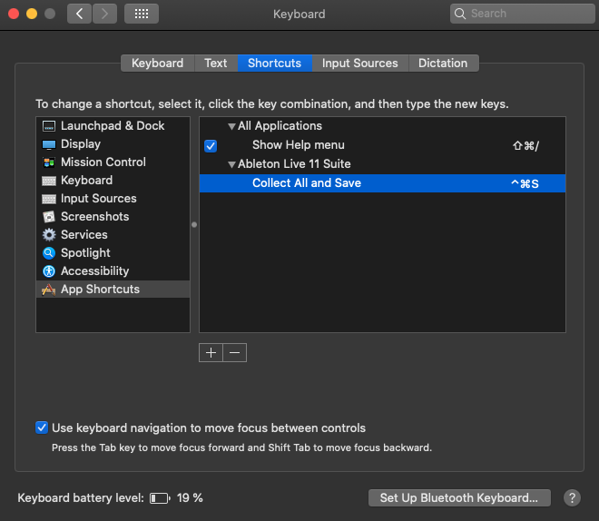

# Why is it important to “Collect All and Save” on Ableton?

> TLDR: This allows you to copy locally all the samples used in your project, making it standalone.

## Description
The `Collect All and Save` feature will basically copy on the local project folder `Samples/Imported/` the samples that are used on Ableton. You can select the type of samples you want to copy. If storage is not an issue for you, I strongly suggest selecting all the files, so you make your project fully standalone.

<small><i>Collect All and Save options</i></small>

## Ableton architecture
To understand the process involved, let's have an overview of an Ableton project architecture.

When you create an Ableton project, you will have a basic architecture containing basically 3 folders and your live set.

<small><i>Ableton project basic architecture</i></small>

- `Ableton Project Info/` : this contains Ableton specific files, unrelated to this article.
- `Backup/` : this contains older versions of your live set, generated by Ableton autosave function.
- `Samples/` : this contains the samples used or generated by Ableton. This specific folder is the one we are interested in.

Let’s dive into Ableton Samples folder. This is where all the sample management happens.

- `Imported/` : this is where the files imported by Ableton using the `Collect All and Save` feature are stored.
- `Processed/` : this contains the files generated by Ableton. This happens by performing actions like consolidating samples or freezing a track (which basically exports the track as a long audio sample).
- `Recorded/` : this contains the samples that were directly recorded into Ableton (microphone, external instrument…).

## Extra tip (for Mac users)
While the `Collect All and Save` function is crucial on Ableton samples management, it is surprisingly not assigned to any shortcuts.

In order to make this command more accessible, you can set it up as a shortcut on Mac. If you know a similar procedure on Windows, do not hesitate to comment on the article, I will happily add it.

To setup the shortcut:

1. Go to `System Preferences --> Keyboard --> Shortcuts`
2. Select the `App Shortcuts` category at the bottom
3. Press the `+` button
4. Select `Ableton Live` clicking the `All Applications` dropdown
5. Type exactly the `Collect All and Save` command and add the shortcut you want. In my case I chose `ctrl + cmd + S`

<small><i>Mac shortcut configuration</i></small>

