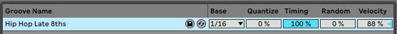

# Ableton file types

This is a description of the different file types used in Ableton. I decided to categorise them based on my own experience, regarding their scope of action.

<!--  -->

<small><i>Ableton overview</i></small>

> *TLDR: Here is an alphabetical list of the different Ableton file types*  
`.adg` (Ableton Device Group)  
`.adv` (Ableton Device Preset)  
`.agr` (Ableton Groove)  
`.alc` (Ableton Live Clips)  
`.alp` (Ableton Live Pack)  
`.als` (Ableton Live Set)  
`.ams` (Ableton Meta Sound)  
`.amx`d (Ableton Max For Live Device)  
`.asd` (Ableton Sample Analysis File)  
`.ask` (Ableton Skin File)  

## Project related
- `.als` (Ableton Live Set) : this is the extension used whenever you save a live set. It is the core of your project, gathering information about your song, the structure of your beat, your clips/scenes arrangement, the path to the samples… It is also used for templates as it contains the same kind of information.
- `.alp` (Ableton Live Pack) : this is basically a compressed version of an Ableton project, meaning it contains both the live set and the related content (back ups, samples…).

## Devices related
- `.adg` (Ableton Device Group) : this contains a rack of instruments and/or effects. It can used to save effect chains, complex instruments…

<small><i>.adg example</i></small>

- `.adv` (Ableton Device Preset) : this stores presets of a single device. It can be saved as the default preset by right clicking on the device top bar.

<small><i>.adv example</i></small>

- `.amxd` (Ableton Max For Live Device) : it describes a device developed using Max For Live, which is a development environment tailored for Ableton. However, you can use those devices without having to program them(https://maxforlive.com).

## Data related
- `.alc` (Ableton Live Clips) : this is a way to store session clips information. It can be both an audio or a midi clip. For midi clips, it saves as well everything from the channel strip (intruments, effects…).

- `.agr` (Ableton Groove) : this contains MIDI information concerning rythm. It is used to modify the timing of MIDI clip elements.

<small><i>.agr example</i></small>

- `.ams` (Ableton Meta Sound) : this is the format used to export Operator generated waveforms. Those can then be reloaded inside Operator, but also into Sampler, Simpler or an audio track.

<small><i>.ams example</i></small>

## Utility
- `.asd` (Ableton Sample Analysis File) : this is an Ableton file produced whenever you add samples to your live set. It contains various metadata like tempo information, beat position, warp markers… This will speed up the process any time you are using this sample.

- `.ask` (Ableton Skin File) : this is an XML file containing Ableton visual information.

<small><i>.ask example</i></small>

