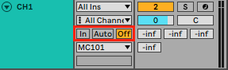
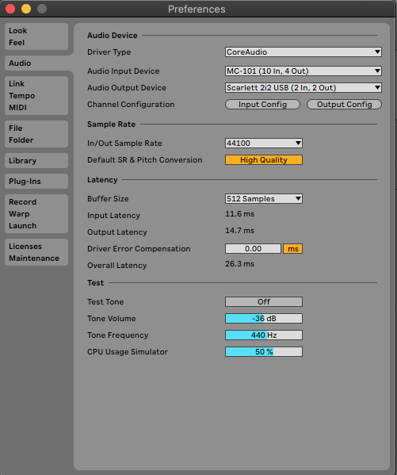
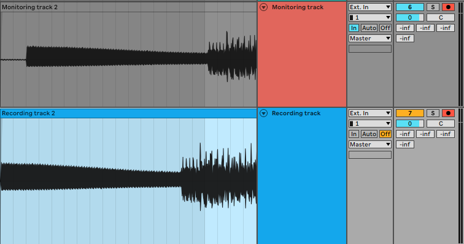
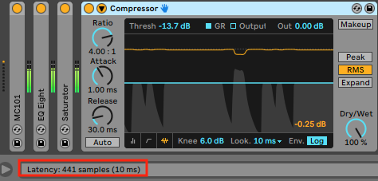
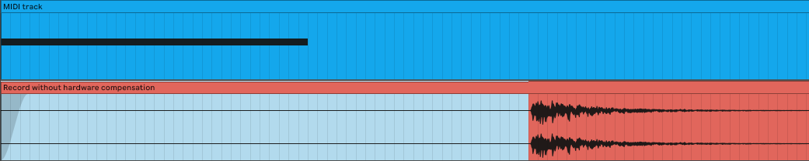
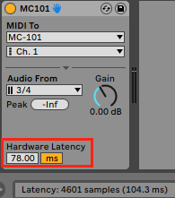
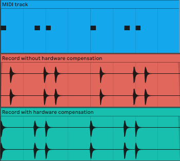
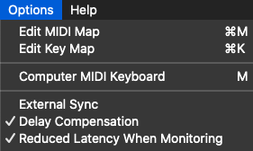
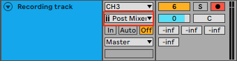

# Ableton latency
> TLDR: You will find 3 mains possible causes of latency in Ableton: monitoring, plugin delay and hardware latency.

If you ever tried to record audio on Ableton, you might have experienced some kind of latency. We will explore the different phenomenons that could cause latency and descibe them. Then we will explains the different options to deal resolve this issue, depending of your use case.

## Three types of latency
### System latency (Monitoring)
The first latency that can occur is when you monitor the audio of the track you are recording. Monitoring allows you to select whether you want to hear or mute the signal you are recording.

<small><i>Monitoring settings</i></small>

- **In**: this settings allow you to here the signal that is played live onto this track, without the need to enable the recording on it. It could be used for live performance for example.
- **Auto**: with this settings, you will be able to hear the live signal only if the recording is enable **and** there is no prerecorded signal on the timeline if Ableton is playing. Otherwise Ableton will decide to mute the live signal and play the already recorded one.
- **Off**: here you will simply never monitor the live signal.

In case you are actually monitoring the incoming signal, this will add a latency due to your system, meaning the time the signal takes to go from your input to your output speakers.

This latency is found under Ableton *Preferences → Audio*. Its value depends directly on your `buffer size`, but as low you your CPU allows you to set it, monitoring will always introduce some latency. The lower your `buffer size` is, the smaller the latency will be, but at the cost of a higher CPU usage.

<small><i>Ableton latency</i></small>

If you want to avoid your system latency, you need to record audio in a track without monitor it. We can observe the delay introduced by the system on the picture below.

<small><i>Monitoring delay</i></small>

### Plugin delay
The second type of latency introduced is due to the plugins processing time. Indeed, some plugins inserted into the effect chain of your track will introduce some delay. It can be because of an heavy signal processing, or because some plugins need what is called lookahead time, which means that the plugins will process the signal after it is played, and not in real time. In the example below, we can see that the compressor introduces a latency of 441 samples due to a lookahead time of 10ms.

<small><i>Plugin delay</i></small>

Some plugins do not introduce latency, like `EQ Eight`, `Utility`, `Auto Filter`, … The latency introduced with each plugin is displayed in the info bar when you select it.

> Please not that by default, Ableton automatically compensate plugin delay at playback time. It calculates the delay for each track and apply the maximum value to all tracks in order to start the sound of each of them at the same time.

### Hardware latency
Finally, if you are using an hardware synthesiser which is MIDI controlled by Ableton, it adds extra steps with its own processing time, that Ableton can not compensate as it is different for each synth.

In order to to measure this latency, you have to setup a midi track and insert Ableton `External Instrument`. This device allows you to both send MIDI to your synth, monitor incoming audio, and will include the system latency as its own latency. By using it, Ableton will then automatically compensate both the system latency introduced by the monitoring, and the plugin delay caused by audio processing.

By recording the audio generated by the MIDI sequence in another track, you compare the audio offset with the MIDI trigger of the note. In order to be as accurate as possible, I advice to play sounds with a short attack.

<small><i>Hardware latency measurement</i></small>

Once you recorded the sequence into audio, you can observe the offset introduced by your hardware latency. Hovering this offset will displayed it length on the info bar at the bottom (see the picture below).

<small><i>Hardware latency displayed</i></small>

Knowing this latency, you can compensate it by specifying it in the `External Instrument` settings.

<small><i>Ableton External Instrument</i></small>

After you set this, you can observe that you can record MIDI sequences without any latency.

<small><i>Hardware latency compensation</i></small>

## Recording external instruments / microphones
If you want to record a signal being played directly to your sound-card, like a guitar or a microphone, without latency, you need to turn of the monitoring. This will avoid getting the system latency, and the plugin delay.

However, this means that you will not be able to hear what you are playing. This might not be an issue if you are singing as you can hear your own voice, but could be more problematic playing an electric guitar for example.

In order to keep monitoring without introducing latency, you can do it in three different ways:
1. Reducing the `Buffer size` as low as possible for the *monitoring track*. Depending on your CPU, the latency introduced could still be playable. You still have to set a second *recording track* without monitoring so you will not get any latency.
2. Most sound-cards on the market already provide *direct monitoring*. This allows you here what is coming directly in the sound-card, without adding the system latency. Please not that with this method, you will not be able to hear the effects that you might have added on your track.
3. The last option is to enable `Reduced Latency When Monitoring` in the `Options`. This will basically disable the global `Delay Compensation` for this specific track. You will then be able to monitor with minimal latency, but as explained before, `Delay Compensation` allow tracks synchronisation at playback. This means that if you keep this settings once the recording is done, this track will be out of sync with the rest of your tracks.

<small><i>Reduced latency setting</i></small>

## Recording external synth with MIDI keyboard
### External instrument
In order to record a hardware synthesiser, the best option is to us Ableton’s `External Instrument` that we previously studied.

To record you track, you can do it with 2 differents ways:

1. **Freezing the track**: by freezing the track where `External Instrument` is inserted, you can get the audio signal with its latency compensated. However, this does not allow you to perform live modification from the hardware synth as it is strictly recording the MIDI sequence.
2. **Record into another track**: to do so, you have to make sure that you select the audio which is sent `Post Mixer` if you want to include the inserted effects. With this method, you can record your synth and its live modifications.

<small><i>Post Mixer recording</i></small>

