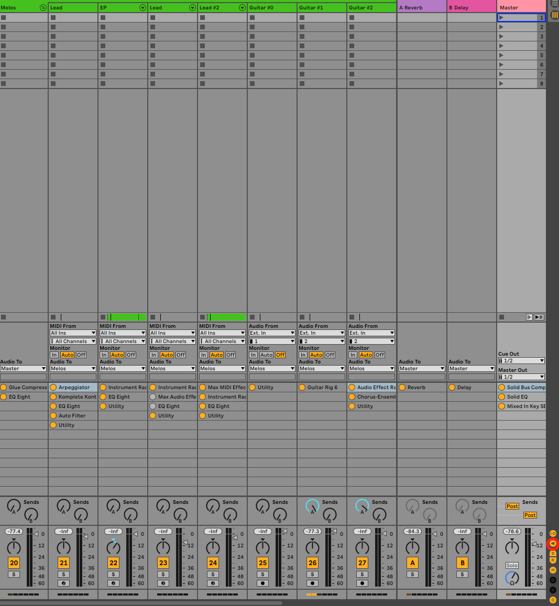
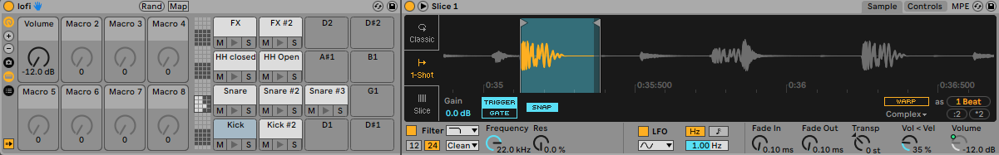
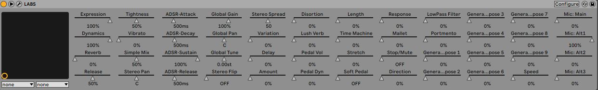

# How to expand Ableton features with Options.txt?
> TLDR: You can find below list of the available options presented in this article.
```
-ShowDeviceSlots
-EnableArmOnSelection
-AutoAdjustMacroMappingRange
-_PluginAutoPopulateThreshold
```

Today I will walk you through some Ableton hidden features. Indeed, beyond Ableton default functionalities, there is a way to expand them using experimental features. Those are not officially supported and may not work anymore by the time you are reading this article. You can find the official statement of Ableton regarding those functionalities [here](https://help.ableton.com/hc/en-us/articles/209772865-Le-fichier-Options-txt).

In this article, I will show you the ones that I use the most. In order to have a full list of the available options, you can check [this file](../../options_txt/lists/full_options_list.txt).

## Available options
`ShowDeviceSlots`

- `-ShowDeviceSlots=1`

This is the first option I experimented, and is still to me one of the most useful . It allows Ableton’s mixer to show the devices loaded in each track. Enabling this option to Ableton will add a small icon on the right side, allowing you to show/hide the devices in the mixer, as you would do for send tracks. It can show up to 12 devices per tracks, which you can select clicking on their names or enable/disable clicking the yellow circle next to it.

<div align="center"><p><small><i>Mixer with ShowDeviceSlots enabled</i></small></p></div>

## EnableArmOnSelection
- `-EnableArmOnSelection`

This option is pretty straightforward, it basically arms automatically the track you selected.

## AutoAdjustMacroMappingRange
- `-AutoAdjustMacroMappingRange`

Whenever you map a parameter to a macro with this option enabled, it will set the minimum macro value range to the current parameter value. In the example below, I mapped the volume parameter when its value was `-12dB`, which sets the lowest macro value to `-12dB`. If this option was disable, it would instead set it to the lower possible value, which is `-36dB`.

<div align="center"><p><small><i>Volume macro minimum set to -12dB instead of -36dB</i></small></p></div>

## PluginAutoPopulateThreshold
- `-_PluginAutoPopulateThreshold=128`

When enabled, this option automatically populates a plugin parameters list, from `1` up to `128`. This is useful as it then allows you to quickly map the ones you are interested in to Ableton macros.

<div align="center"><p><small><i>LABS plugin with all the parameters already populated</i></small></p></div>

## How to add options?
We previously studied the common hidden features of Ableton. Now we will describe how to configure Ableton to set up those options.

> Windows → `C:\Users\[Username]\AppData\Roaming\Ableton\[Live x.x.x]\Preferences\`

> Mac → `HD/Users/[Username]/Library/Preferences/Ableton/[Live x.x.x]/`

1. Create a plain text file named Options.txt at the location above. Make sure to select the folder of your current Live version.

2. Add the options you want to enable.

3. Restart Ableton Live to activate the newly added options.

If you receive any error message at startup regarding the Options.txt file, you could fix it by checking that you followed those rules:
- only one option per line
- each option starts with a dash `-`
- some options need as well an underscore `_`

In case you do not manage to fix it, you can safely remove `Options.txt` as it only concerns experimental features and will not alter Ableton general behaviour.

As an example, you can find [here](../../options_txt/Options.txt) my personal `Options.txt` file.

## Ableton Live 11
With the release of the recent Ableton Live 11, many features are not working anymore, either because they have been natively added to Ableton, or because they have been removed. I tried the full options list and you can find here the outcome:
- [list](../../options_txt/lists/options_available_live_11.txt) of the options working with Ableton 11
- [list](../../options_txt/lists/options_removed_live_11.txt) of the options that have been removed in Ableton Live 11