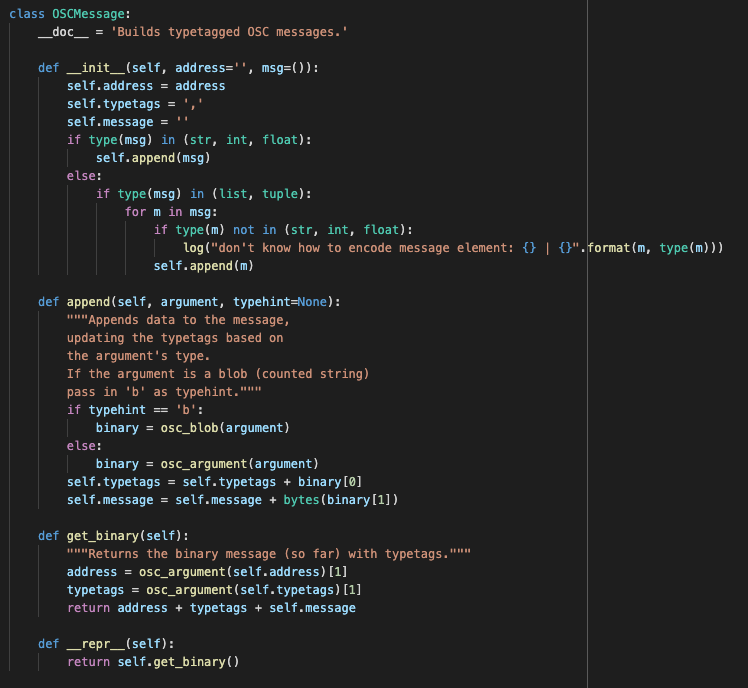
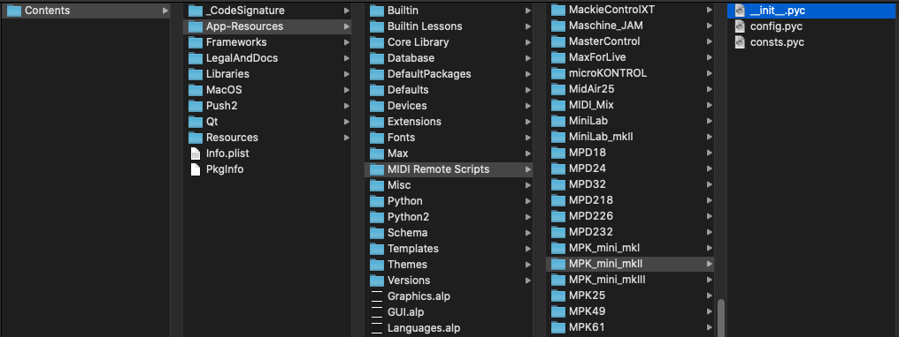

# Ableton script types
> TLDR: There are two main types of script used in Ableton, the User Remote Scripts (config files) and the MIDI Remote Scripts (python files).

<small><i>Example of MIDI Remote Script</i></small>

In Ableton, you will encounter mainly two types of scripts, the `User Remote Scripts` and the MIDI Remote Scripts. In this article, we will have an overview of the purpose of those scripts, their differences and how to handle them. A following article will show how to write `User Remote Scripts`.

In both cases, the scripts are meant to interact with what Ableton calls Control Surface, and which basically are your MIDI controllers. They will allow it to interact directly with Ableton Live software.

- **User Remote Scripts**: those are scripts that are meant to be set up by the user, following Ableton guidelines.
**MIDI Remote Scripts**: those are python scripts provided by Ableton for the controllers they support natively.

## Description
### User Remote Scripts
Those scripts allow the users to easily add control over Ableton through their MIDI controllers. As this mechanism is officially supported by Ableton, it is documented and made as easy as possible, meaning users can tailor the scripts to their needs without extensive programming skills.

It is useful if your device is not supported by default, or if you want to modify his original behaviour.

#### Location
> Windows → `C:\Users\[Username]\AppData\Roaming\Ableton\[Live x.x.x]\Preferences\User Remote Scripts`

> Mac → `HD/Users/[Username]/Library/Preferences/Ableton/[Live x.x.x]>User Remote Scripts`

Those folders are by default only containing Ableton help files about this mechanism:
- an [help file](../../articles_ressources/user_remote_scripts/InstantMappings-HowTo.txt) named `InstantMappings-HowTo.txt`
- a [template file](../../articles_ressources/user_remote_scripts/UserConfiguration.txt) named `UserConfiguration.txt`

<small><i>User Remote Scripts location</i></small>

#### Installation
To add a new `User Remote Script`, you have to:
1. Create a new folder on the `User Remote Script` location. The name you will use is the one that will appear in the Control Surfaces list in Ableton. *Be careful not starting with ‘_’ or ‘.’*.
2. Copy the `User Remote Script` file in the folder, naming it `UserConfiguration.txt`.

*If you are interested in writing your own scripts, I will link here my next week’s article about this topic.*

### MIDI Remote Scripts
Those scripts are provided by Ableton when you install it. They allow most of the MIDI controllers to be natively usable within Ableton. Those factory scripts are python compiled code, meaning they are not human readable, but contain machine readable code.

#### Location
> Windows → `C:\Program Data\Ableton\Live x.x.x\Ressources\MIDI Remote Scripts`

> Mac → `HD/Applications/Ableton/Contents/App-Ressources/Midi Remote Scripts`

<small><i>MIDI Remote Scripts location</i></small>

#### Installation
To add a `MIDI Remote Script`, you once again have to copy the folder containing it, but this can be done in 2 different locations:
- the old way was to copy it at the same location of the native `MIDI Remote scripts`. It is still working with the current Ableton Live 11 version.
- since Live 10.1.13 however, it is recommended to place it into your user library, creating a Remote Scripts folder `Ableton/User Library/Remote Scripts`.

## How to use them?
For both script types, the procedure to use them is the same. Everything has to be setup in Ableton Live `Preferences`, under the `Link/Tempo/MIDI` tab.

<small><i>Preferences MIDI section</i></small>

Once in this tab, you have 3 different columns:
- `Control Surface`: this is where you select the script you want to use.
- `Input & Output`: this is where you choose the connected MIDI Controller you want the script to be applied to.

As you can see, the first line is a native `MIDI Remote Script` provided by Ableton. On the second line however, it is an homemade `User Remote Script`.

You can as well add a `User Remote Script` on top of a `MIDI Remote Script` if you want to overwrite some of its behaviour.