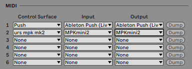

# Ableton User Remote Scripts
> TLDR: Programming Ableton User Remote Scripts will allow you to expand and personalise your way of controlling Live with your MIDI controllers

If you are interested in an extensive description of Ableton Scripts files, you can find [here](../ableton_script_types/README.md) a full article about it.

In order to setup your MIDI controller to interact with Ableton the way you have decided, you can write Ableton User Remote Scripts. This is a mechanism provided by Ableton that lets you easily write your own scripts.

<small><i>User Remote Script Example</i></small>

## Programmation
### Script structure
The [script file](../../articles_ressources/user_remote_scripts/UserConfiguration.txt) provided by Ableton named UserConfiguration.txt already provides the skeletton of the parameters and some help. Basically, modifying it consists of replacing the parameters you want to modify, leaving the others one to their default values.

It is divided in 4 mains parts, each one controlling different parameter sets:
- `[Globals]`: sets up MIDI general parameters
- `[DeviceControls]`: controls selected device parameters
- `[MixerControls]`: controls the following mixer parameters of the first 8 tracks → [volume /send 1&2 / arm]
- `[TransportControls]`: controls Ableton Live transports functions

### Parameters
We are now going to see the different parameter types contained into an `Ableton User Remote Script` and the values they can handle. The way this file is configured is by getting one instruction per line, that can be of different types:
- `[xxx]` → category line, used by Ableton parser to read the configuration file. This should not be modified.
- `# xxx` → comments, written by Ableton to provide some help. You can also add yours by starting a line with a `#`. Please note that those lines are not read by Ableton, so do not insert any setting value or they will not be applied.
- `Parameter: value` → those are the lines you will have to modify. It works as a duo with a parameter and its assigned value. 
If you want to give a parameter its default value, just set it to `-1`.

The parameters you can setup will be from different types:
- *MIDI channel*: this will specify which MIDI channel is used by the control. The MIDI channels range from 1 to 16, but as often in programming, the setup values start from 0. This means you can setup MIDI channel 1 by specifying its value to `0`. The full range of values goes from `0` to `15` for channel 16.
- *Control Changes*: those are signals sent by your controller to interact with Ableton Live. Those can vary from 1 to 128, and once again the setup value starts at `0`, and goes up to `127`.
- *Notes*: even if notes are most often natively interpreted by Ableton, you can overwrite it for pads and specify your own mapping. This is especially interesting to map Ableton drumracks order. As for control changes, notes vary from 1 to 128, and hence can be setup from `0` to `127`. In order to find the corresponding value, you have to use the [MIDI Tuning Standard](https://medium.com/@ibekso/ableton-user-remote-scripts-75cc413c21b8), which sets the middle C (261.63 Hz)to `60`. You can then find the other notes by adding `1` for each semitone. For example, the A above middle C will be setup to `69`.

In order to know which value is sending a specific control, you can follow this procedure:
- Enter Ableton MIDI Map Mode by pressing `cmd + M` / `ctrl + M`.
2. Press any assignable parameter, which are highlighted in blue.
3. Action the control you want to assign. It will show its value as follows: `A/B`, with `A` being the MIDI channel, and `B` its value.

<small><i>Example of MIDI control value (channel 1 value 5)</i></small>

### Categories
In this section, we will now get into the details of each category, reviewing all the parameters available and how they can be set up.

#### Globals
- `GlobalChannel`: sets the MIDI channel used by your controller. By default on most controller it will be channel 1, meaning you have to set it to 0
- `InputName`/`OutputName`: here you have to specify your controller name as it appears inside Ableton Preferences → MIDI tab, so it can automatically assign the corresponding script

You can as well map your MIDI controller pads to match Ableton drumracks. The order Ableton labels its pads is shown below:

<small><i>Ableton pads order</i></small>

- `PadXNote`: maps the corresponding pad to the MIDI note it sends
- `PadXChannel`: sets the pad’s MIDI channel

#### DeviceControls
This section allows you to control the selected Ableton device. To know which one is currently selected, Ableton shows a blue hand icon close to its name (see picture below).

<small><i>DeviceControls view</i></small>

- `EncoderX`: controls the macro parameters of the selected device
- `EncoderChannelX`: sets the encoder’s MIDI channel
- `EncoderMapMode`: this sets the map mode of your controller, which is basically the way it transmits data to Ableton. This can be found into your controller’s documentation. In case you do not manage to find it, you can test through trials and errors by modifying its value with the ones proposed in the comments.
- `BankXButton` / `NextBankButton` / `PrevBankButton`: a bank of controls is a pool of 8 controls. If your device has more than 8 controls, you can navigate those parameters to the different bank settings. This will either go directly to the bank X, or scroll though the next or the previous bank.
- `LockButton`: locks the controls to the current selected device. It means that this device will be controlled even if you focus another device or change track.

#### MixerControls
Here you can setup your MIDI controller to interact with Ableton’s mixer of the 8 first tracks. Unfortunately, you can not control more tracks with a `User Remote Script`, this can only be done via `MIDI Remote Script`, which requires Python knowledge and is not openly supported by Ableton.

<small><i>MixerControls view</i></small>

- `VolumeSliderX`: controls track X volume slider
- `SliderXChannel`: sets the slider’s MIDI channel
- `MasterVolumeSlider`: controls the master volume slider
- `MasterSliderChannel`: sets the master slider’s MIDI channel
- `Send1KnobX`: controls the send 1 amount of track X
- `Send2KnobX`: controls the send 1 amount of track X
- `TrackArmButtonX`: arms track X
- `VolumeMapMode` / `SendsMapMode`: as in the previous section, this sets the map mode of your MIDI controller

#### TransportControls
The last part of the script is the most straightforward one, and allows you to control Ableton transports.

<small><i>Ableton transports</i></small>

- `StopButton` / `PlayButton` / `RecButton`: performs stop/play/record actions
- `LoopButton`: activates the loop inside Ableton arrangement view
- `RwdButton` / `FfwdButton`: moves the playhead position backward/forward into the arrangement view

## Installation
### Location
> Windows → `C:\Users\[Username]\AppData\Roaming\Ableton\[Live x.x.x]\Preferences\User Remote Scripts`

> Mac → `HD/Users/[Username]/Library/Preferences/Ableton/[Live x.x.x]>User Remote Scripts`

To install your script, you have to:
1. Create a new folder on the `User Remote Script` location. The name you will use is the one that will appear in the Control Surfaces list in Ableton. *Be careful not starting with ‘_’ or ‘.’*.
2. Copy your script file in the folder, naming it `UserConfiguration.txt`.

Once you have copied your script, you have to restart Ableton so it is detected by Live.

## Configuration
Your new script now has to be set up with your MIDI controller in Ableton Live `Preferences`, under the `Link/Tempo/MIDI` tab.

<small><i>Preferences MIDI section</i></small>

Once in this tab, you have 3 different columns:
- `Control Surface`: this is where you select the script you want to use.
- `Input & Output`: this is where you choose the connected MIDI Controller you want the script to be applied to.

As you can see, the first line is a native `MIDI Remote Script` provided by Ableton (more information [here](../ableton_script_types/README.md)). On the second line however, it is our homemade `User Remote Script`.
You can now try the new behaviour of your MIDI controller.