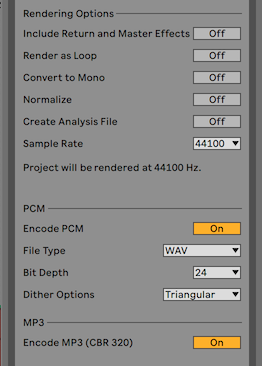
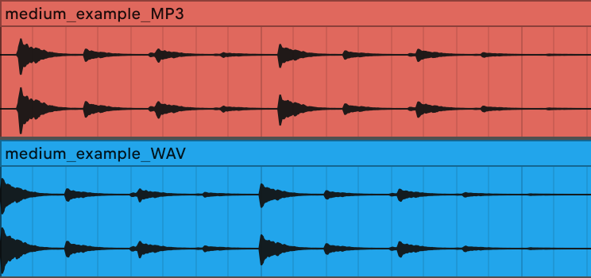

# Why should you avoid exporting stems in MP3?
> TLDR: Because MP3 conversion algorithm introduces an offset at the beginning of the samples.

Today I am sharing with you an issue I recently encountered. I used to collaborate online using [Satellite Plugins](https://mixedinkey.com/satellite/) from Mixed In Key, which is a VST that allows you to seamlessly collaborate remotely, whatever DAW you are using. *By the way, you can let me know in the comments if you would be interested in an article about this plugin.*

However, for my last collaboration, we decided to export individual stems and load them directly in the DAW. To avoid any band path issue and speed up the process, I decided to export the stems in `MP3`, that was a bad idea! Indeed, it appeared that my stems were out synced when imported in an existing project. I decided to investigate this issue, and discovered something I was not expected: exporting in **MP3 format introduces an offset at the beginning of the sample**.

## Observing the issue
In order to illustrate the aforementioned issue, I decided to reproduce the issue, documenting the process. I exported a hit hat loop in two different formats, WAV and MP3, using the following Ableton settings:
- **global section** → all options disabled & sample rate = 44100 Hz
- **PCM section** → WAV | 24b | triangular
- **MP3 section** → using the default CBR 320 encoding

<small><i>Export parameters overview</i></small>

Once exported, I imported both stems without any processing in a new Ableton session. As expected, I noticed that the `MP3` export adds an offset at the beginning of the audio, resulting in the `MP3` stem being out of sync.

<small><i>MP3 / WAV export comparison</i></small>

This is illustrated in the picture above:
- **red clip** → *MP3* export
- **blue clip** → *WAV* export

## Explaining the phenomenon
The main difference between MP3 and WAV is that they belong to 2 different format categories:
- **lossy formats** (`MP3`, `AAC`, `WMA`, `OGG`): the compression of those formats degrades the data in order to save space. This is particularly useful for streaming, and allows users to store more songs per storage unit.
- **lossless formats** (`WAV`, `FLAC`, `ALAC`): those formats are uncompressed, resulting in a better audio quality, and a much larger space footprint.

In order to get compressed, *lossy formats* require an encoder that converts the audio file. During the compression, encoders add padding (*ie empty data, silence*), which size vary depending on the algorithm used. Some encoders, like [LAME MP3](https://lame.sourceforge.io) includes the padding size in the metadata, which allows the decoder to automatically trim the audio file, removing the extra silence.

However, Ableton Live has not yet implemented padding detection for `MP3` format (as of its version 11.0.6) and the whole file is decoded, which results in an extra silence at the beginning of the audio file. Some programs exist to automatically trim your `MP3` files afterwards and remove the silences, but it is beyond the scope of this article.

*If you want to go deeper into tech details regarding encoding/decoding, I recommend this [article](https://lame.sourceforge.io/tech-FAQ.txt) from the LAME MP3 encoder.*

On the other side, *lossless formats* are not compressed and hence do not contain this padding. My advice here is to stick to `WAV` exports (or any *lossless format*), and you will be safe with those sync issues.