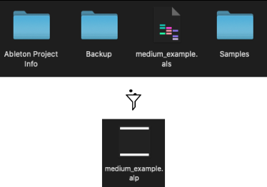
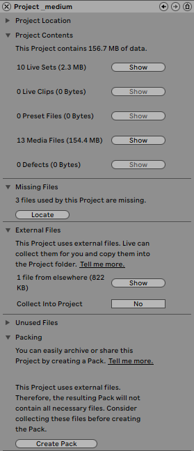

# How to collaborate sharing Ableton projects?
> TLDR: Use the built-in Ableton “Export pack” function, located in the Manage files... window.

As a producer, you may want to collaborate with others. In case you are using different DAWs, this article will not help. However, if you both use Ableton, this describes the method I recommend to share projects without getting into troubles.

Indeed, Ableton already has a function that allows you to pack a full project with the associated samples, back-ups and more in a single `.alp` file. If you want more information about filetypes, I made an entire [article](../ableton_file_types/README.md) about it.

## Process
1. Open the `File Management` window by clicking on the `file --> Manage Files...`
2. Choose the `Manage Project` option.
3. If you have any missing files issue, you have to fix it either by deleting the reference if the project does not use it anymore, or by locating them on your computer.
4. Make sure you do not have any external files in the related section. If you do, perform a `Collect All and Save` so you have them copied locally.
5. Create an Ableton Pack `(.alp)` by clicking on `Create Pack` at the bottom of the window.

<small><i>File management window</i></small>

You can now share this Ableton Pack as a single file with other producers.

*An Ableton Pack is basically an archive that you could do on your own. However, this means you have to gather all the files by yourself, perform the proper checks that everything is here, and make sure that your collaborator has the correct tool to unzip it.*

## Description
There are other information you can get from this Manage project view. We will go more in-depth about it in this section.

<small><i>Manage Project window</i></small>

- `Project Location`: this shows the file path to where your project is located on your computer.
- `Project Contents`: this is a summary of your project, where you can inspect the different resources it uses.
- `Missing Files`: this indicates which file references are broken.
- `External Files`: this shows the external files you are using and offers to collect them into project. You then have to perform a Collect All and Save at the bottom if you want to make your pack autonomous.
Unused Files: this displays the files that are not used in this live set. however, be careful because this does not mean they are not used by another project. So you have to know what you are doing before deleting them.
- `Packing`: this is the step that allows you to create an Ableton Pack.