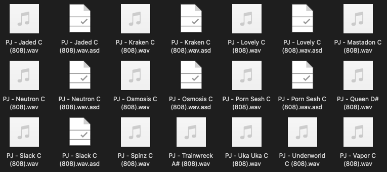
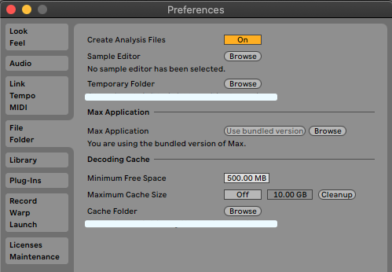
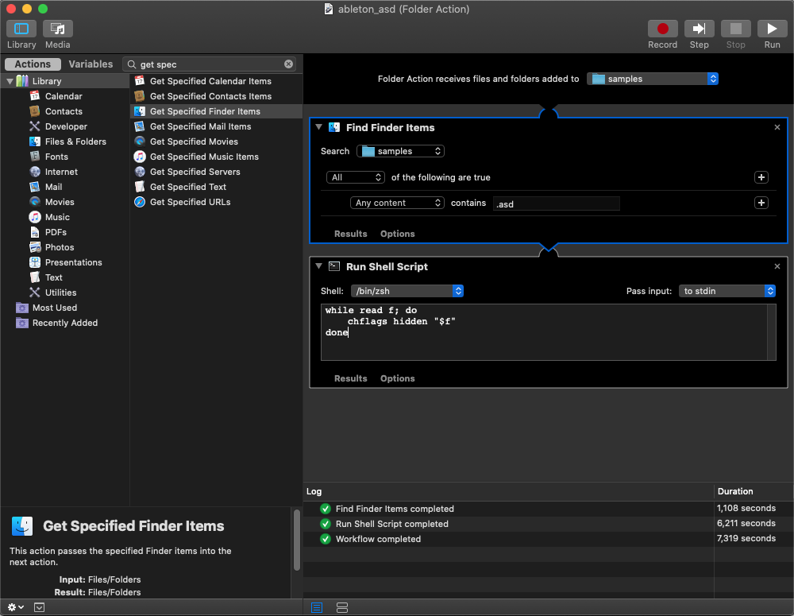

# Que sont les fichiers ASD?
> TLDR: Les fichiers .asd accélèrent le traitement audio en stockant les métadonnées Ableton comme le tempo, le warping, les paramètres des clips...

En tant qu'utilisateur d'Ableton, vous avez peut-être fait l'expérience de la création automatique d'un fichier `.asd` dans votre dossier de samples. Dans cet article, je vais vous expliquer ce que sont ces fichiers et à quoi ils servent. Je décrirai ensuite les différentes façons dont vous pouvez les gérer.

<div align="center"><p><small><i>Fichiers Ableton .asd</i></small></p></div>

## Que sont les fichiers ASD?

Il s'agit d'un [type de fichier Ableton](../ableton_types_fichiers/README.md) spécial utilisé pour accélérer le traitement par Ableton. Si vous activez cette option, un fichier `.asd` sera généré à chaque fois que vous importez ou enregistrez des samples audio sur Ableton, si un fichier `.asd` n'existe pas déjà. Il contient diverses métadonnées de son fichier correspondant `nom_du_fichier.wav` comme le tempo, les points de warping, les paramètres des clips. Cela évite de répéter le processus d'analyse d'Ableton la prochaine fois que vous utiliserez cet échantillon.

## Comment les gérer?

### Suppression des fichiers d'analyse

Les fichiers d'analyse sont utiles car ils permettent à Ableton d'être plus efficace, vous pouvez néanmoins les supprimer si vous êtes gênés par cette création automatique. Cela n'affectera pas le fichier `.wav` qui lui est associé, mais cela signifie qu'Ableton analysera ces fichiers à chaque fois que vous l'utiliserez dans un projet.

### Désactiver les fichiers d'analyse

Comme nous l'avons vu précédemment, les fichiers `.asd` sont utiles mais pas obligatoires. En effet, Ableton propose un moyen de désactiver la création automatique des fichiers d'analyse via son menu de préférences.

> Préférences → File/Folder → Créer fichiers d'analyse

<div align="center"><p><small><i>Paramétrages fichiers .asd</i></small></p></div>

### Cacher les fichiers d'analyse

Si vous souhaitez conserver la création des fichiers `.asd` mais que vous ne voulez plus les voir, vous pouvez simplement les masquer.

#### Sur macOS

> En utilisant la ligne de commande

Afin de cacher les fichiers `.asd` sur mac, vous pouvez exécuter la commande suivante :

- `chflags hidden <path_to_your_folder>/*.asd`

Si vous changez d'avis et voulez annuler la commande précédente, vous pouvez exécuter la commande suivante :

- `chflags nohidden <path_to_your_folder>/*.asd`

> En utilisant automator

Pour automatiser ce processus, vous pouvez également utiliser mac OS automator :

1. Créer un nouveau `Folder Action`
2. Ajouter `Find Finder Items`  et configurez-le pour qu'il recherche votre dossier de samples, en filtrant les fichiers dont l'extension est `.asd`.
3. Ajouter `Run Shell Script` avec le script suivant

```
while read f; do
 chflags hidden "$f"
done
```

Vous pouvez maintenant exécuter ce script automator.

<div align="center"><p><small><i>macOS automator script</i></small></p></div>

#### Sur Windows

Malheureusement, comme je ne possède pas d'ordinateur Windows, je ne peux pas fournir de conseils similaires, mais j'ai tout de même trouvé quelques suggestions intéressantes sur ce [fil de discussion](https://forum.ableton.com/viewtopic.php?t=217627#p1789520). Je n'ai pas eu l'occasion de les tester, alors n'exécutez ces commandes que si vous savez ce que vous faites.