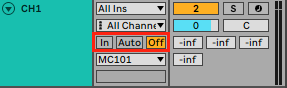
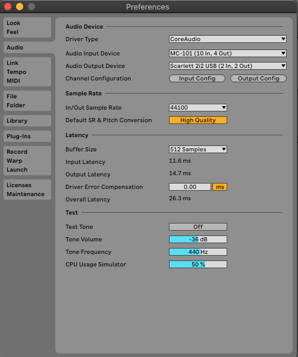
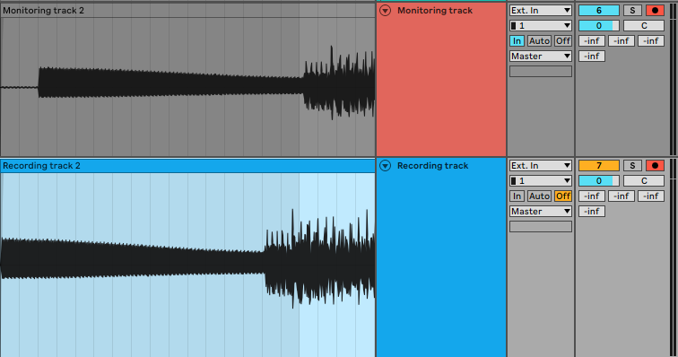
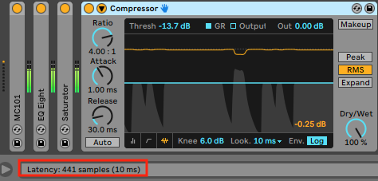
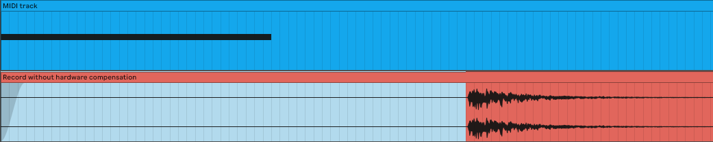
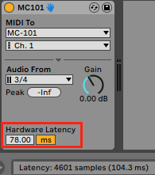
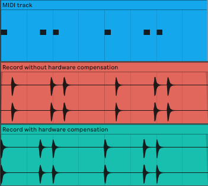
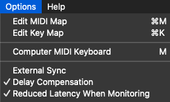
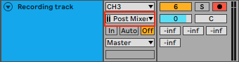

# Gérer la latence avec Ableton

> TLDR: Vous trouverez 3 principales causes possibles de latence dans Ableton : le monitoring, le délai des plugins et la latence introduite par le matériel externe.

Si vous avez déjà essayé d'enregistrer de l'audio sur Ableton, vous avez peut-être fait l'expérience d'une certaine forme de latence. Nous allons explorer les différents phénomènes qui peuvent causer cette latence, puis nous découvrirons les différentes options pour résoudre le problème, en fonction de votre cas d'utilisation.

## Trois types de latence

### Latence du système (Monitoring)

La première latence qui peut se produire est lorsque vous monitorez l'audio de la piste que vous enregistrez. Le monitoring vous permet de paramétrer la manière dont vous souhaitez contrôler le signal audio que vous enregistrez.

<small><i>Paramètres de Monitoring</i></small>

- **In**: permet d'entendre le signal audio de la piste, sans avoir besoin d'activer l'enregistrement sur celle-ci. Ce réglage peut être utilisé pour une performance en direct par exemple.
- **Auto**: avec ce réglage, vous ne pourrez entendre le signal audio que si l'enregistrement de la piste est activé **et** qu'il n'y a pas de signal préenregistré sur la timeline, dans le cas où Ableton joue. Sinon, Ableton décidera de couper le signal live et de lire le signal déjà enregistré.
- **Off**: desactive le monitoring du signal audio, quelque soit la situation.

Dans le cas où vous monitorez le signal entrant, cela ajoutera une latence due à votre système, c'est-à-dire le temps que le signal prend pour aller de l'entrée de votre carte son à vos haut-parleurs de sortie.

Cette latence se trouve sous Ableton *Préférences → Audio*. Sa valeur dépend directement de votre `taille de mémoire tampon`, mais quelque soit le réglage que votre CPU vous permet d'atteindre, le monitoring introduira toujours une certaine latence. Plus votre `taille de tampon` est basse, plus la latence sera faible, mais au prix d'une utilisation plus importante de votre CPU.

<small><i>Latence d'Ableton</i></small>

Si vous voulez éviter la latence de votre système, vous devez enregistrer l'audio dans une piste en désactivant le monitoring. Nous pouvons observer le retard introduit par le système sur l'image ci-dessous.

<small><i>Délai de Monitoring</i></small>

### Retard des plugins

Le deuxième type de latence introduit est dû au temps de traitement des plugins. En effet, certains plugins insérés dans la chaîne d'effets de votre piste vont introduire un certain délai. Cela peut être dû à un traitement lourd du signal, ou parce que certains plugins ont besoin de ce qu'on appelle du temps de `lookahead`, ce qui signifie que les plugins vont traiter le signal après qu'il soit joué, et non en temps réel. Dans l'exemple ci-dessous, nous pouvons voir que le compresseur introduit une latence de 441 échantillons en raison d'un temps de `lookahead` de 10ms.

<small><i>Retard de Plugin</i></small>

Certains plugins n'introduisent pas de latence, particulièrement les plugins natifs d'Ableton comme `EQ Eight`, `Utility`, `Auto Filter`, ... La latence introduite par chaque plugin est affichée dans la barre d'information lorsque vous le sélectionnez.

> Veuillez noter que par défaut, Ableton compense automatiquement le retard des plugins au moment de la lecture. Il calcule le retard pour chaque piste et applique un délai égal à la valeur maximale à toutes les pistes afin de faire démarrer le son de chacune d'entre elles en même temps.

### Latence du matériel

Enfin, si vous utilisez Ableton pour contrôler en MIDI un synthétiseur matériel, ce dernier ajoute une latence due à son propre temps de traitement, qu'Ableton ne peut pas compenser car elle est indépendante de sa latence système et variable pour chaque synthétiseur.

Afin de mesurer cette latence, vous devez configurer une piste midi et insérer un `External Instrument` d'Ableton. Ce dispositif vous permet à la fois d'envoyer du MIDI à votre synthé, de monitorer l'audio entrant, et de configurer la latence du synthétiseur, permettant de la transmettre à Ableton. En l'utilisant, Ableton compensera alors automatiquement la latence du système introduite par le monitoring, et le retard du plugin causé par le traitement audio.

#### Mesure de la latence

Afin de connaitre la latence de votre synthéthiseur, vous devez enregistrer l'audio généré par la séquence MIDI dans une autre piste. Cela vous permet d'observer le décalage entre le déclenchement MIDI de la note et son audio. Afin d'être le plus précis possible, je conseille de jouer des sons avec une attaque courte.

<small><i>Mesure de la latence du matériel</i></small>

Une fois que vous avez enregistré la séquence en audio, vous pouvez observer le décalage introduit par votre latence matérielle. En survolant ce décalage, vous afficherez sa longueur sur la barre d'information en bas (voir l'image ci-dessous).

<small><i>Affichage de la latence matérielle</i></small>

Connaissant cette latence, vous pouvez la compenser en la spécifiant dans les paramètres de l'instrument `External Instrument`.

<small><i>Ableton External Instrument</i></small>

Après avoir paramétrer la latence, vous pouvez enregistrer des séquences MIDI sans aucune latence.

<small><i>Compensation de la latence matérielle</i></small>

## Enregistrement d'instruments / microphones externes

Si vous souhaitez enregistrer un signal joué directement sur votre carte son, comme une guitare ou un microphone, sans latence, vous devez désactiver le monitoring. Vous éviterez ainsi de subir la latence du système et le retard des plugins.

Cependant, cela signifie que vous ne serez pas en mesure d'entendre ce que vous jouez. Ce n'est peut-être pas un problème si vous chantez, car vous pouvez entendre votre propre voix, mais cela peut être plus problématique si vous jouez de la guitare électrique, par exemple.

Afin de maintenir le monitoring sans introduire de latence, vous pouvez procéder de trois manières différentes :
1. Réduire la `taille de mémoire tampon` aussi bas que possible pour la *piste de monitoring*. En fonction de votre CPU, la latence introduite peut s'avérer suffisament faible pour permettre le jeu. Vous devez toujours définir une seconde *piste d'enregistrement* sans monitoring pour ne pas avoir de latence.
2. La plupart des cartes son du marché fournissent déjà une option de *direct monitoring*. Cela vous permet d'entendre ce qui arrive directement dans la carte son, sans ajouter la latence du système. Veuillez noter qu'avec cette méthode, vous ne serez pas en mesure d'entendre les effets que vous avez pu ajouter sur votre piste Ableton.
3. La dernière option est d'activer `Latence réduite en écoute` dans les `Options`. Cela va essentiellement désactiver la compensation globale de retard. Vous serez alors en mesure de monitorer avec une latence minimale, mais comme expliqué précédemment, la "compensation de retard" permet la synchronisation des pistes à la lecture. Cela signifie que si vous conservez ces paramètres une fois l'enregistrement terminé, cette piste sera désynchronisée par rapport au reste de vos pistes.

<small><i>Latence réduite en écoute</i></small>

## Enregistrement d'un synthétiseur externe avec un clavier MIDI

### External instrument

Afin d'enregistrer un synthétiseur matériel, la meilleure option est d'utiliser le `External Instrument` d'Ableton que nous avons étudié précédemment.

Pour enregistrer votre piste, vous pouvez le faire de 2 manières différentes :

1. **Geler la piste** : en gelant la piste où est inséré le `External Instrument`, vous pouvez obtenir le signal audio avec sa latence compensée. Cependant, cela ne vous permet pas d'effectuer des modifications en temps réel à partir du synthétiseur matériel car il enregistre strictement la séquence MIDI.
2. **Enregistrez dans une autre piste** : pour ce faire, vous devez vous assurer que vous sélectionnez l'audio qui est envoyé `Post Mixer` si vous voulez inclure les effets insérés. Avec cette méthode, vous pouvez enregistrer votre synthé et ses modifications en direct.

<small><i>Enregistrement Post Mixer</i></small>

