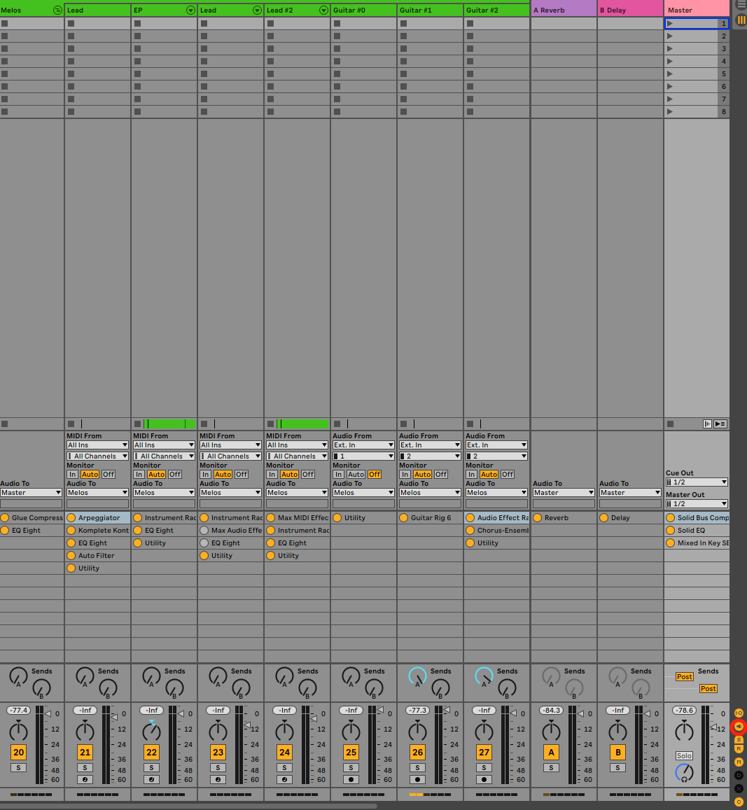
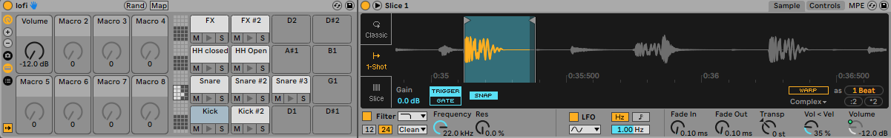
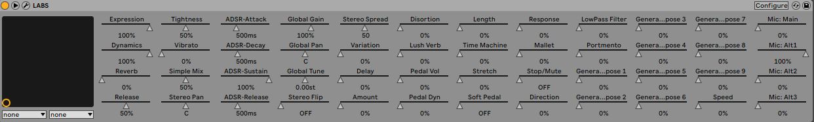

# Comment étendre les fonctionnalités d'Ableton avec Options.txt ?

> TLDR: Vous pouvez trouver ci-dessous la liste des options disponibles présentées dans cet article.
```
-ShowDeviceSlots
-EnableArmOnSelection
-AutoAdjustMacroMappingRange
-_PluginAutoPopulateThreshold
```

Aujourd'hui, je vais vous présenter quelques fonctionnalités cachées d'Ableton. En effet, au-delà des fonctionnalités par défaut d'Ableton, il existe un moyen de les étendre en utilisant des fonctionnalités expérimentales. Celles-ci ne sont pas officiellement supportées et peuvent ne plus fonctionner au moment où vous lisez cet article. Vous pouvez trouver la déclaration officielle d'Ableton concernant ces fonctionnalités [ici](https://help.ableton.com/hc/fr-fr/articles/209772865-Le-fichier-Options-txt).

Dans cet article, je vais vous montrer celles que j'utilise le plus. Pour avoir une liste complète des options disponibles, vous pouvez consulter [ce fichier](../../articles_ressources/options_txt/lists/full_options_list.txt).

## Options disponibles

`ShowDeviceSlots`

- `-ShowDeviceSlots=1`

C'est la première option que j'ai expérimentée, et c'est toujours pour moi l'une des plus utiles. Elle permet au mixeur d'Ableton de montrer les périphériques chargés dans chaque piste. Activer cette option dans Ableton ajoutera une petite icône sur le côté droit, vous permettant d'afficher/masquer les périphériques dans la table de mixage, comme vous le feriez pour les pistes d'envoi. Elle peut afficher jusqu'à 12 périphériques par pistes, que vous pouvez sélectionner en cliquant sur leurs noms ou activer/désactiver en cliquant sur le cercle jaune à côté.

<div align="center"><p><small><i>Mixeur avec l'option ShowDeviceSlots activée</i></small></p></div>

## EnableArmOnSelection
- `-EnableArmOnSelection`

Cette option est assez simple, elle arme automatiquement la piste que vous avez sélectionnée.

## AutoAdjustMacroMappingRange
- `-AutoAdjustMacroMappingRange`

Chaque fois que vous mappez un paramètre à une macro avec cette option activée, la plage de valeur minimale de la macro est définie par la valeur actuelle du paramètre. Dans l'exemple ci-dessous, j'ai mappé le paramètre volume lorsque sa valeur était `-12dB`, ce qui fixe la valeur minimale de la macro à `-12dB`. Si cette option était désactivée, elle la fixerait à la plus basse valeur possible, qui est `-36dB`.

<div align="center"><p><small><i>Le volume minimum de la macro est réglé à -12dB au lieu de -36dB</i></small></p></div>

## PluginAutoPopulateThreshold
- `-_PluginAutoPopulateThreshold=128`

Lorsqu'elle est activée, cette option expose automatiquement une liste des paramètres du plugin. La longueur de cette liste dépend de la valeur paramétré, allant de `1` à `128`. Cela vous permet ensuite de mapper rapidement les paramètres qui vous intéressent à des macros Ableton.

<div align="center"><p><small><i>Plugin LABS avec l'ensemble de ses paramètres exposés automatiquement</i></small></p></div>

## Comment ajouter des options ?

Nous avons précédemment étudié les fonctionnalités cachées courantes d'Ableton. Nous allons maintenant décrire comment configurer Ableton pour mettre en place ces options.

> Windows → `\Utilisateurs\[nom d'utilisateur]\AppData\Roaming\Ableton\[Live x.x.x]\Preferences\`

> Mac → `/Utisateurs/[nom d'utilisateur]/Library/Preferences/Ableton/[Live x.x.x]/`

1. Créez un fichier texte nommé `Options.txt` à l'emplacement ci-dessus. Veillez à sélectionner le dossier de votre version actuelle de Live.

2. Ajoutez les options que vous souhaitez activer.

3. Redémarrez Ableton Live pour que les options nouvellement ajoutées soient prises en compte.

If you receive any error message at startup regarding the Options.txt file, you could fix it by checking that you followed those rules:
- une seule option par ligne
- chaque option commence par un tiret `-`
- certaines options commencent par un underscore `_`

Si vous ne parvenez pas à le corriger, vous pouvez supprimer `Options.txt` en toute sécurité, car il ne concerne que des fonctionnalités expérimentales et ne modifiera pas le comportement général d'Ableton.

A titre d'exemple, vous pouvez trouver [ici](../../articles_ressources/options_txt/Options.txt) mon fichier `Options.txt` personnel.

## Ableton Live 11
Avec la sortie du récent Ableton Live 11, de nombreuses fonctionnalités ne fonctionnent plus, soit parce qu'elles ont été ajoutées nativement à Ableton, soit parce qu'elles ont été supprimées. J'ai essayé la liste complète des options et vous pouvez trouver ici le résultat :

- [liste](../../articles_ressources/options_txt/lists/options_available_live_11.txt) des options fonctionnant avec Ableton 11
- [liste](../../articles_ressources/options_txt/lists/options_removed_live_11.txt) des options qui ont été supprimées dans Ableton Live 11.