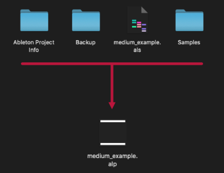
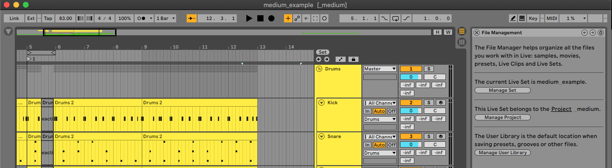
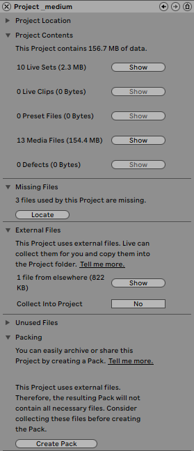

# Comment collaborer en partageant ses projets Ableton?

> TLDR: Utilisez la fonction intégrée d'Ableton "Créer Pack", située dans la fenêtre "Gérer Fichiers..."..

En tant que producteur, vous pouvez avoir envie de collaborer avec d'autres personnes. Si vous utilisez des DAW différents, cet article ne vous sera d'aucune utilité. En revanche, si vous utilisez tous les deux Ableton, voici la méthode que je vous recommande pour partager des projets sans rencontrer de problèmes.

En effet, Ableton possède déjà une fonction qui vous permet de regrouper un projet complet avec les samples associés, les sauvegardes et autres dans un seul fichier `.alp`. Si vous voulez plus d'informations sur les types de fichiers, j'ai fait un [article](../ableton_types_fichiers/README.md) à ce sujet.

## Processus

1. Ouvrez la fenêtre `Gérer Fichiers` en cliquant sur le Fichier --> Gérer Fichiers...`
2. Choisissez l'option `Gérer le projet`.
3. Si vous avez un problème de fichiers manquants, vous devez le résoudre soit en supprimant la référence si le projet ne l'utilise plus, soit en les localisant sur votre ordinateur.
4. Assurez-vous que vous n'avez pas de fichiers externes dans la section relative. Si c'est le cas, effectuez un `Réunir et sauvegarder` afin de les copier localement.
5. Créez un pack Ableton `(.alp)` en cliquant sur `Créer Pack` en bas de la fenêtre.

<small><i>Fenêtre 'Gestion de fichiers'</i></small>

Vous pouvez maintenant partager ce pack Ableton sous la forme d'un fichier unique avec d'autres producteurs.

*Un pack Ableton est en réalité une archive que vous pourriez faire vous-même. Cependant, cela signifie que vous devez rassembler tous les fichiers par vous-même, effectuer les vérifications appropriées pour vous assurer que tout est là, et vous assurer que votre collaborateur a le bon outil pour le décompresser.*

## Description
Il y a d'autres informations que vous pouvez obtenir à partir de cette vue `Gérer le projet`. Nous allons y revenir plus en détail dans cette section.

<small><i>Fenêtre `Gérer le Projet`</i></small>

- `Emplacement du Projet`: indique le chemin où votre projet est situé sur votre ordinateur.
- `Contenu du Projet`: résume l'état de votre projet, où vous pouvez visualiser les différentes ressources utilisées.
- `Fichiers manquants`: indique les fichiers dont les références sont érronées.
- `Fichiers externes`: montre les fichiers externes que vous utilisez et propose de les collecter dans le projet. Vous devez alors "Réunir et Sauvegarder" si vous souhaitez rendre votre pack autonome.
- `Fichiers inutilisés`: affiche les fichiers qui ne sont pas utilisés dans ce liveset. Cependant, cela ne signifie pas qu'ils ne sont pas utilisés par un autre projet. Vous devez donc faire attention avant de les supprimer.
- `Compactage`: étape permettant de créer un pack Ableton.