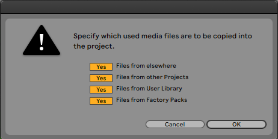
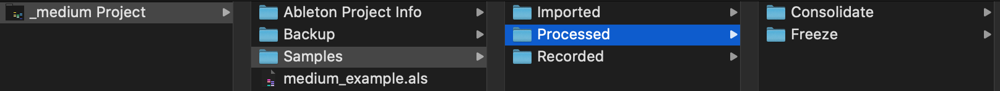
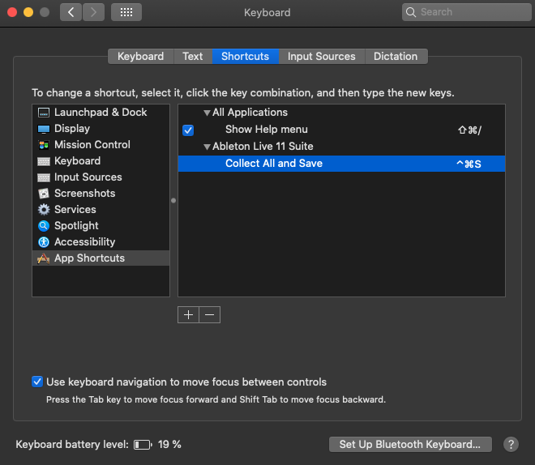

# Pourquoi est-il important de "Réunir et Sauvegarder" dans Ableton?

> TLDR: Cela permet de copier localement tous les samples utilisés dans votre projet, le rendant ainsi autonome.

## Description

La fonction  `Collect All and Save`   copie dans le dossier local du projet `Samples/Imported/` les échantillons qui sont utilisés sur Ableton. Vous pouvez sélectionner le type de samples que vous voulez copier. Si le stockage n'est pas un problème pour vous, je suggère de sélectionner tous les fichiers, afin de rendre votre projet complètement autonome. 

<small><i>Collect All and Save options</i></small>

## Système de fichiers Ableton

Pour comprendre le mécanisme en jeu, voyons d'abord l'architecture d'un projet Ableton.

Lorsque vous créez un projet Ableton, vous aurez une architecture de base contenant essentiellement 3 dossiers et votre live set.

<small><i>Ableton project basic architecture</i></small>

- `Ableton Project Info/` : contient des fichiers spécifiques à Ableton, sans rapport avec cet article.
- `Backup/` : contient les anciennes versions de votre live set, générées par la fonction de sauvegarde automatique d'Ableton.
- `Samples/` : contient les échantillons utilisés ou générés par Ableton. Ce dossier spécifique est celui qui nous intéresse.

Plongeons dans le dossier Samples d'Ableton. C'est ici que se fait toute la gestion des échantillons.

- `Imported/` : c'est ici que sont stockés les fichiers importés par Ableton en utilisant la fonction `Réunir et Sauvegarder`.
- `Processed/` : contient les fichiers générés par Ableton. Cela se produit lorsque vous effectuez des actions comme la consolidation d'échantillons ou le gel d'une piste (qui exporte essentiellement la piste comme un échantillon audio).
- `Recorded/` : contient les samples qui ont été enregistrés directement dans Ableton (microphone, instrument externe...).

## Astuce (pour les utilisateurs de Mac)

Alors que la fonction `Réunir et Sauvegarder` est cruciale dans la gestion des échantillons d'Ableton, elle n'est étonnamment assignée à aucun raccourci.

Pour rendre cette commande plus accessible, vous pouvez la configurer comme un raccourci sur le Mac. Si vous connaissez une procédure similaire sous Windows, n'hésitez pas à commenter l'article, je l'ajouterai volontiers.

Pour configurer le raccourci :

1. Allez dans `Préférences système --> Clavier --> Raccourcis`.
2. Sélectionnez la catégorie "Raccourcis d'applications" en bas de page.
3. Appuyez sur le bouton `+`.
4. Sélectionnez "Ableton Live" en cliquant sur la liste déroulante "Toutes les applications".
5. Ecrivez la commande `Réunir et Sauvegarder` et assigner le raccourci de votre choix. Dans mon cas, j'ai choisi `ctrl + cmd + S`

<small><i>Configuration des raccourcis sur Max</i></small>

