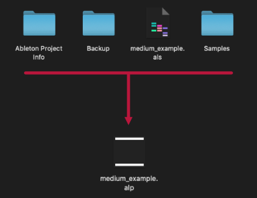
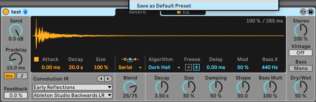
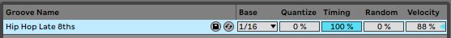
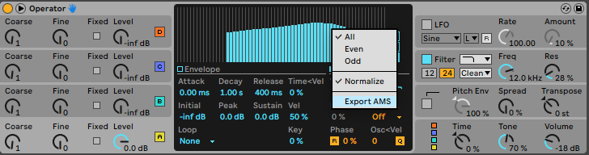
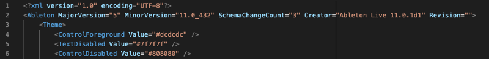

# Types de fichiers Ableton

Dans cet article, nous allons passer en revue les différents types de fichiers utilisés dans Ableton. J'ai décidé de les catégoriser en fonction de leur domaine d'application.

<small><i>Vue d'ensemble d'Ableton</i></small>

> *TLDR: Voici une liste alphabétique des différents types de fichiers Ableton*  
`.adg` (Ableton Device Group)  
`.adv` (Ableton Device Preset)  
`.agr` (Ableton Groove)  
`.alc` (Ableton Live Clips)  
`.alp` (Ableton Live Pack)  
`.als` (Ableton Live Set)  
`.ams` (Ableton Meta Sound)  
`.amxd` (Ableton Max For Live Device)  
`.asd` (Ableton Sample Analysis File)  
`.ask` (Ableton Skin File)  

## Projet

- `.als` (Ableton Live Set) : il s'agit de l'extension utilisée lorsque vous enregistrez un Live Set. C'est le cœur de votre projet, il rassemble des informations sur votre composition, la structure de votre beat, l'arrangement de vos clips/scènes, le chemin vers les samples utilisés... Il est également utilisé pour la création de templates. 
- `.alp` (Ableton Live Pack) : c'est essentiellement une version compressée d'un projet Ableton, contenant à la fois le set live et le contenu associé (backups, samples...) sous la forme d'une archive. Cela lui permet d'être autonome pour un partage lors d'une collaboration par exemple, contrairement au fichier `.als`.

## Devices

- `.adg` (Ableton Device Group) : contient un rack d'instruments et/ou d'effets. Il peut être utilisé pour sauvegarder des chaînes d'effets, des instruments complexes...

<small><i>.adg example</i></small>

- `.adv` (Ableton Device Preset) : permet de stocker les presets d'un seul appareil. Il peut être enregistré comme preset par défaut en faisant un clic droit sur la barre supérieure du périphérique.

<small><i>.adv example</i></small>

- `.amxd` (Ableton Max For Live Device) : décrit un device développé à l'aide de Max For Live, qui est un environnement de développement adapté à Ableton. Toutefois, vous pouvez utiliser ces device sans avoir à les programmer (https://maxforlive.com).

## Données

- `.alc` (Ableton Live Clips) : il s'agit d'un moyen de stocker des informations sur les clips de session. Il peut s'agir d'un clip audio ou midi. Pour les clips midi, il sauvegarde également tout ce qui se trouve sur la piste (instruments, effets...).

- `.agr` (Ableton Groove) : this contains MIDI information concerning rythm. It is used to modify the timing of MIDI clip elements.

<small><i>.agr example</i></small>

- `.ams` (Ableton Meta Sound) : c'est le format utilisé pour exporter les formes d'onde générées par Operator. Celles-ci peuvent ensuite être chargées dans Operator, mais aussi dans Sampler, Simpler ou une piste audio.

<small><i>.ams example</i></small>

## Utilitaires

- `.asd` (Ableton Sample Analysis File) : il s'agit d'un fichier Ableton produit lorsque vous ajoutez des samples audio à votre set live. Il contient diverses métadonnées comme des informations sur le tempo, la mesures, les marqueurs ... Cela permet d'améliorer les performances d'Ableton quand que vous utiliserez de nouveau cet échantillon.

- `.ask` (Ableton Skin File) : c'est un fichier XML contenant des informations visuelles d'Ableton Il peut être modifié pour créer son propre thème.

<small><i>.ask example</i></small>

