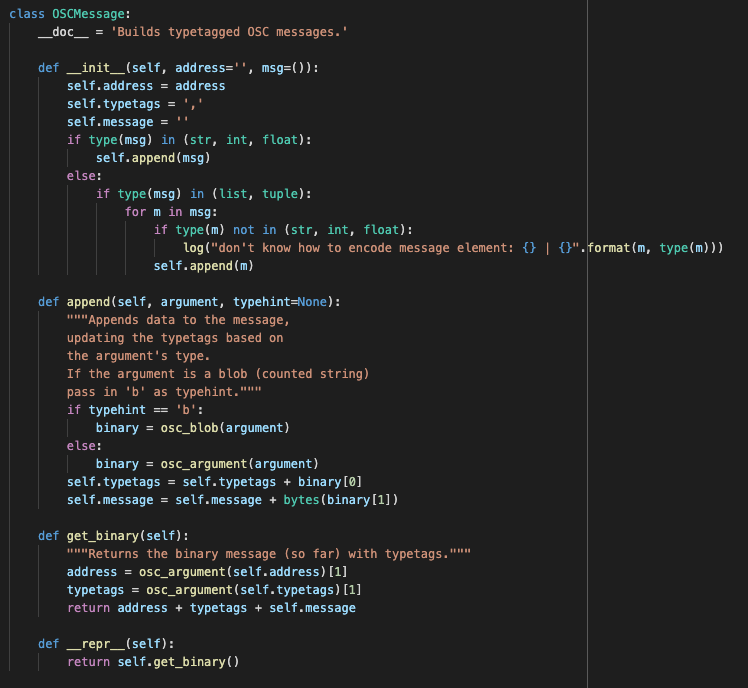
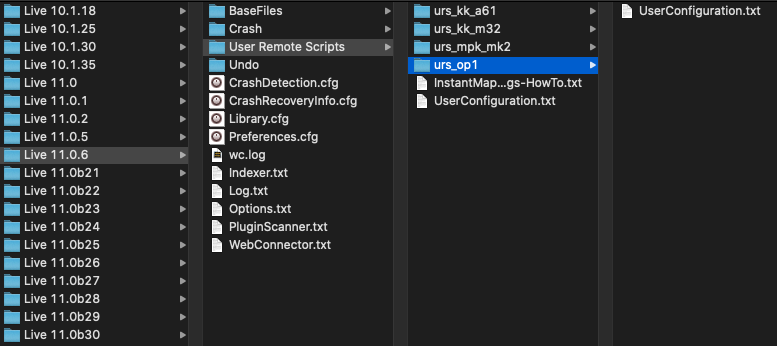
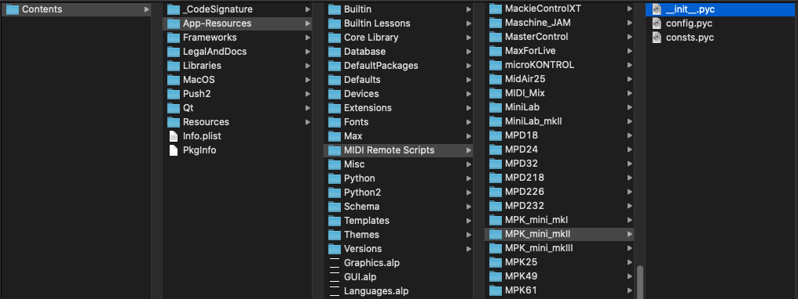
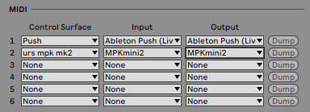

# Types de scripts Ableton

> TLDR: Il existe deux principaux types de scripts utilisés dans Ableton, les User Remote Scripts (fichiers de configuration) et les MIDI Remote Scripts (fichiers python).

<small><i>Exemple de MIDI Remote Script</i></small>

Dans Ableton, vous rencontrerez principalement deux types de scripts, les `User Remote Scripts` et les `MIDI Remote Scripts`. Dans cet article, nous aurons un aperçu de l'objectif de ces scripts, de leurs différences et de la manière de les gérer. Un prochain article montrera comment écrire vos propres `User Remote Scripts`.

Dans les deux cas, les scripts sont destinés à interagir avec ce qu'Ableton appelle des "Surface de Contrôle", qui désignent vos contrôleurs MIDI, leur permettant d'interagir directement avec le logiciel Ableton.

- **User Remote Scripts**: ce sont des scripts qui sont destinés à être mis en place par l'utilisateur, en suivant les [instructions](https://help.ableton.com/hc/fr-fr/articles/206240184-Créer-votre-propre-script-de-surface-de-contrôle) d'Ableton.
**MIDI Remote Scripts**: ce sont des scripts python fournis par Ableton ou les constructeurs pour les contrôleurs qu'ils supportent officiellement.

## Description

### User Remote Scripts
Ces scripts permettent aux utilisateurs de personnaliser le contrôle d'Ableton via leurs contrôleurs MIDI. Comme ce mécanisme est officiellement supporté par Ableton, il est documenté et rendu aussi simple que possible, ce qui signifie que les utilisateurs peuvent adapter les scripts à leurs besoins sans que des compétences en programmation ne soient nécessaires.

Ces scripts sont utiles si votre appareil MIDI n'est pas pris en charge par défaut, ou si vous souhaitez modifier son comportement original.

#### Localisation

> Windows → `C:\Utilisateurs\[Nom d'utilisateur]\AppData\Roaming\Ableton\[Live x.x.x]\Preferences\User Remote Scripts`

> Mac → `HD/Utilisateurs/[Nom d'utilisateur]/Library/Preferences/Ableton/[Live x.x.x]>User Remote Scripts`

Ces dossiers contiennent par défaut uniquement les fichiers d'aide d'Ableton concernant ce mécanisme :
- un [fichier d'aide](../../articles_ressources/user_remote_scripts/InstantMappings-HowTo.txt) nommé `InstantMappings-HowTo.txt`.
- un [modèle](../../articles_ressources/user_remote_scripts/UserConfiguration.txt) nommé `UserConfiguration.txt`.

<small><i>Localisation des User Remote Scripts</i></small>

#### Installation
Pour ajouter un nouveau `User Remote Script`, vous devez :
1. Créer un nouveau dossier dans l'emplacement des `User Remote Script`. Le nom que vous utiliserez est celui qui apparaîtra dans la liste des Surfaces de contrôle dans Ableton. *Faites attention à ne pas commencer par '_' ou '.'*.
2. Copy the `User Remote Script` file in the folder, naming it `UserConfiguration.txt`.

*Si vous êtes intéressés par l'écriture de vos propres scripts, je mettrai un lien vers l'article de la semaine prochaine sur ce sujet.*

### MIDI Remote Scripts

Ces scripts sont fournis par Ableton lorsque vous installez le logiciel. Ils permettent à la plupart des contrôleurs MIDI d'être utilisables nativement dans Ableton. Ces scripts d'usine sont en fait un code compilé en python, ce qui signifie qu'ils ne sont pas lisibles par l'Homme, mais contiennent du code lisible par votre ordinateur.

#### Localisation

> Windows → `C:\Program Data\Ableton\Live x.x.x\Ressources\MIDI Remote Scripts`

> Mac → `HD/Applications/Ableton/Contents/App-Ressources/Midi Remote Scripts`

<small><i>Localisation des MIDI Remote Scripts</i></small>

#### Installation
Pour ajouter un `MIDI Remote Script`, vous devez encore une fois copier le dossier qui le contient, mais cela peut être fait à 2 endroits différents :
- l'ancienne méthode consistait à le copier au même endroit que les `MIDI Remote scripts` natifs (voir ci-dessus). Cela fonctionne toujours avec la version actuelle d'Ableton Live 11.
- depuis Live 10.1.13 cependant, il est recommandé de le placer dans votre bibliothèque utilisateur, en créant un dossier Remote Scripts `Ableton/User Library/Remote Scripts`.

## Comment les utiliser ?

Pour les deux types de script, la procédure pour les utiliser est la même. Tout doit être configuré dans les `Préférences` d'Ableton Live, sous l'onglet `Link/Tempo/MIDI`.

<small><i>Section MIDI des Préférences</i></small>

Une fois cet onglet ouvert, vous avez 3 colonnes différentes :
- `Control Surface`: c'est ici que vous sélectionnez le script que vous souhaitez utiliser.
- `Input & Output`: c'est ici que vous choisissez le contrôleur MIDI connecté auquel vous voulez que le script soit appliqué.

Comme vous pouvez le voir, la première ligne est un script natif `MIDI Remote Script` fourni par Ableton. Sur la seconde ligne cependant (urs mpk mk2), il s'agit d'un `User Remote Script` destiné à modifier le comportement du clavier MIDI MPK Mini.

Vous pouvez aussi ajouter un `User Remote Script` en plus de son `MIDI Remote Script` si vous voulez écraser ses paramètres par défaut.