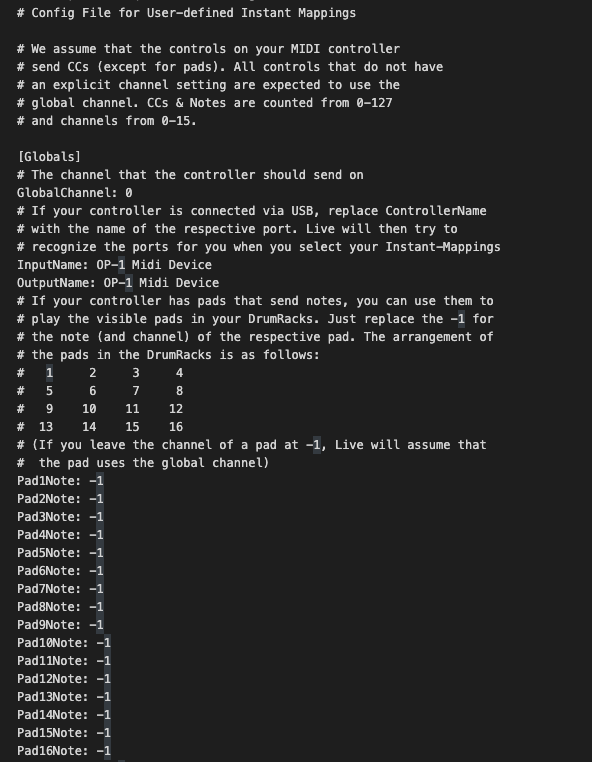
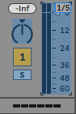
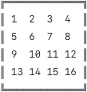
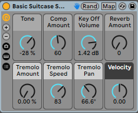
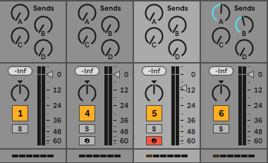
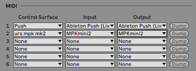

# Ableton User Remote Scripts
> TLDR: Programmer des Ableton User Remote Scripts vous permettra d'étendre et de personnaliser votre façon de contrôler Live avec vos contrôleurs MIDI.

Si vous êtes intéressé par une description détaillée des fichiers Scripts Ableton, vous pouvez trouver [ici](../ableton_types_scripts/README.md) un article complet à ce sujet.

Afin de configurer votre contrôleur MIDI pour qu'il interagisse avec Ableton de manière personnalisée, vous pouvez écrire des Ableton User Remote Scripts. Il s'agit d'un mécanisme fourni par Ableton qui vous permet d'écrire facilement vos propres scripts de configuration.

<small><i>Exemple d'Ableton User Remote Script</i></small>

## Programmation
### Structure du script 

Le [script](../../articles_ressources/user_remote_scripts/UserConfiguration.txt) `UserConfiguration.txt` fourni par Ableton est un modèle contenant le squelette du script et les paramètres que vous pouvez attribuer à votre contrôleur. Afin de le personnaliser, vous pouvez le modifier remplaçant les paramètres que vous souhaitez contrôler, en laissant les autres à leurs valeurs par défaut.

Le script est divisé en 4 parties principales, chacune contrôlant des jeux de paramètres différents :
- `[Globals]`: définit les paramètres généraux MIDI
- `[DeviceControls]`: contrôle les paramètres liés aux devices Ableton
- `[MixerControls]`: contrôle les paramètres de mixage (volume / send 1&2 / arm) des 8 premières pistes
- `[TransportControls]`: contrôle les fonctions de transport d'Ableton Live

### Paramètres
Nous allons maintenant voir les différents types de paramètres qui existent dans un `Ableton User Remote Script` et les actions qu'ils peuvent gérer. Un `Ableton User Remote Script`contient une instruction par ligne, qui peut être de différents types :
- `[xxx]` → ligne de catégorie. Utilisées par Ableton pour déchiffrer le fichier de configuration, ces lignes ne doit pas être modifiées.
- `# xxx` → commentaires, écrits par Ableton pour aider l'utilisateur. Vous pouvez également ajouter les vôtres en commençant une ligne par un `#`. Notez que ces lignes ne sont pas lues par Ableton, donc n'insérez pas de valeur de réglage, sinon elles ne seront pas appliquées.
- `Parameter: value` → ce sont les lignes que vous devrez modifier. Elles fonctionnent comme un duo avec un paramètre et sa valeur attribuée. 
Si vous voulez donner à un paramètre sa valeur par défaut, il suffit de le mettre à `-1`.

Les paramètres que vous pouvez configurer seront de différents types :
- *MIDI channel*: ceci spécifiera quel canal MIDI est utilisé pour le contrôle. Les canaux MIDI vont de 1 à 16, mais comme souvent en programmation, les valeurs de configuration commencent à 0. Cela signifie que vous pouvez configurer le canal MIDI 1 en spécifiant sa valeur à `0`. La gamme complète des valeurs va de `0` à `15` pour le canal 16.
- *Control Changes*: ce sont les signaux envoyés par votre contrôleur pour interagir avec Ableton Live. Ils peuvent varier de 1 à 128, et encore une fois la valeur de réglage commence à `0`, et va jusqu'à `127`.
- *Notes*: même si les notes sont le plus souvent interprétées nativement par Ableton, vous pouvez reconfigurer leur affectation et spécifier votre propre mapping. Ceci est particulièrement intéressant pour mapper l'ordre des drumracks d'Ableton. Comme pour les changements de contrôle, les notes varient de 1 à 128, et peuvent donc être configurées de `0` à `127`. Pour trouver la valeur correspondante, vous devez utiliser le [MIDI Tuning Standard](https://fr.wikipedia.org/wiki/MIDI_Tuning_Standard), qui définit le Do central (261.63 Hz) à `60`. Vous pouvez ensuite trouver les autres notes en ajoutant `1` pour chaque demi-ton. Par exemple, le la au-dessus du do central sera réglé sur 69.

Afin de savoir quelle valeur envoie un contrôle spécifique, vous pouvez suivre cette procédure :
1. Entrez dans le mode MIDI Map d'Ableton en appuyant sur `cmd + M` / `ctrl + M`.
2. Appuyez sur n'importe quel paramètre assignable, ceux-ci sont surlignés en bleu.
3. Actionnez le contrôle que vous voulez assigner. Sa valeur s'affichera comme suit : `A/B`, avec `A` étant le canal MIDI, et `B` sa valeur.

<small><i>Exemple de valeure de contrôle MIDI (channel 1 value 5)</i></small>

### Catégories
Dans cette section, nous allons maintenant entrer dans les détails de chaque catégorie, en passant en revue tous les paramètres disponibles et la façon dont ils peuvent être configurés.

#### Globals
- `GlobalChannel`: définit le canal MIDI utilisé par votre contrôleur. Par défaut, sur la plupart des contrôleurs, ce sera le canal 1, ce qui signifie que vous devez le régler sur 0.
- `InputName`/`OutputName`: ici vous devez spécifier le nom de votre contrôleur tel qu'il apparaît dans les préférences d'Ableton → onglet MIDI, afin qu'il puisse automatiquement assigner le script correspondant.

Vous pouvez également faire correspondre les pads de votre contrôleur MIDI aux `drumracks` d'Ableton. L'ordre dans lequel Ableton ordonne ses pads est indiqué ci-dessous :

<small><i>Ordre des drumracks Ableton</i></small>

- `PadXNote`: associe le pad correspondant à la note MIDI qu'il envoie.
- `PadXChannel`: définit le canal MIDI du pad.

#### DeviceControls
Cette section vous permet de contrôler le périphérique Ableton sélectionné. Pour savoir lequel est actuellement sélectionné, Ableton affiche une icône de main bleue à proximité de son nom (voir image ci-dessous).

<small><i>Vue du DeviceControls</i></small>

- `EncoderX`: contrôle les paramètres macro du dispositif sélectionné.
- `EncoderChannelX`: définit le canal MIDI du paramètre.
- `EncoderMapMode`: définit le mode de mappage de votre contrôleur, qui est la façon dont il transmet les données à Ableton. Ce paramètre peut être trouvé dans la documentation de votre contrôleur. Si vous n'arrivez pas à le trouver, vous pouvez faire des essais en modifiant sa valeur avec celles proposées dans les commentaires, jusqu'à ce que l'association fonctionne.
- `BankXButton` / `NextBankButton` / `PrevBankButton`: une banque de contrôles est un ensemble de 8 contrôles. Si votre `device` Ableton a plus de 8 contrôles, vous pouvez naviguer au sein de ces paramètres grace aux différentes banques. Ces paramètres vous permettent d'aller directement à la banque X (`BankXButton`)ou de faire défiler la banque suivante ou précédente (`NextBankButton` / `PrevBankButton`).
- `LockButton`: vérrouille les commandes sur le `device` sélectionné. Cela signifie que ce`device` sera contrôlé même si vous cliquez sur une autre `device` ou si vous changez de piste.

#### MixerControls
Ici, vous pouvez configurer votre contrôleur MIDI pour interagir avec le mixeur d'Ableton des 8 premières pistes. Malheureusement, vous ne pouvez pas contrôler plus de 8 pistes avec un `User Remote Script`, cela ne peut se faire que via un `MIDI remote script`, qui nécessite des connaissances en Python et n'est pas officiellement supporté par Ableton.

<small><i>Vue MixerControls</i></small>

- `VolumeSliderX`: contrôle le curseur de volume de la piste X.
- `SliderXChannel`: définit le canal MIDI du curseur.
- `MasterVolumeSlider`: contrôle le curseur de volume du master.
- `MasterSliderChannel`: définit le canal MIDI du curseur du master.
- `Send1KnobX`: contrôle la quantité d'envoi vers le send 1 de la piste X.
- `Send2KnobX`: contrôle la quantité d'envoi vers le send 2 de la piste X.
- `TrackArmButtonX`: arme la piste X.
- `VolumeMapMode` / `SendsMapMode`: comme dans la section précédente, ceci définit le mode de transmission de votre contrôleur MIDI.

#### TransportControls
La dernière partie du script est la plus simple, et vous permet de contrôler les fonction de transport Ableton.

<small><i>Fonctions de transport d'Ableton</i></small>

- `StopButton` / `PlayButton` / `RecButton`: effectue des actions d'arrêt, de lecture et d'enregistrement.
- `LoopButton`: active la boucle dans la vue arrangement d'Ableton.
- `RwdButton` / `FfwdButton`: déplace la position de la tête de lecture en arrière/en avant dans la vue d'arrangement.

## Installation
### Localisation

> Windows → `C:\Utilisateurs\[Nom d'utilisateur]\AppData\Roaming\Ableton\[Live x.x.x]\Preferences\User Remote Scripts`

> Mac → `HD/Utilisateurs/[Nom d'utilisateur]/Library/Preferences/Ableton/[Live x.x.x]>User Remote Scripts`

Pour installer votre script, vous devez :
1. Créez un nouveau dossier dans l'emplacement `User Remote Script`. Le nom que vous utiliserez est celui qui apparaîtra dans la liste des Surfaces de Contrôle dans Ableton. *Faites attention à ne pas commencer par '_' ou '.'*.
2. Copiez votre fichier script dans le dossier, en le nommant `UserConfiguration.txt`.

Une fois que vous avez copié votre script, vous devez redémarrer Ableton pour qu'il soit pris en compte par Ableton.

## Configuration
Votre nouveau script doit maintenant être configuré avec votre contrôleur MIDI dans les `Préférences` d'Ableton Live, sous l'onglet `Link/Tempo/MIDI`.

<small><i>Section MIDI des Préférences</i></small>

Une fois dans cet onglet, vous avez 3 colonnes différentes :
- `Control Surface`: c'est ici que vous sélectionnez le script que vous voulez utiliser.
- `Input & Output`: c'est ici que vous choisissez le contrôleur MIDI auquel vous voulez associé le script.

Comme vous pouvez le voir, la première ligne est un `MIDI Remote Script` natif fourni par Ableton (plus d'informations [ici](../ableton_types_scripts/README.md)). Sur la deuxième ligne, c'est notre `User Remote Script` que nous avons configurer (`urs mpk mk2`).

Vous pouvez maintenant contrôler Ableton à l'aide de votre propre script.