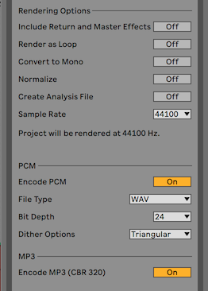
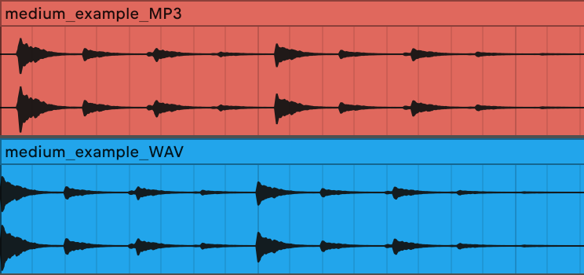

# Pourquoi faut-il éviter d'exporter des stems en MP3 ?
> TLDR: Parce que l'algorithme de conversion MP3 introduit un décalage au début des échantillons.

Aujourd'hui, je partage avec vous un problème que j'ai récemment rencontré. J'avais l'habitude de collaborer en ligne en utilisant [Satellite Plugins](https://mixedinkey.com/satellite/) de Mixed In Key, un VST qui vous permet de collaborer à distance quel que soit le DAW que vous utilisez. *Par ailleurs, n'hésitez pas à me faire savoir dans les commentaires si vous êtes intéressés par un article sur ce plugin.

Cependant, lors de ma dernière collaboration, nous avons décidé d'exporter des stems individuelles et de les insérer directement dans Ableton. Pour éviter tout problème réseau et accélérer le processus, j'ai décidé d'exporter les stems en `MP3`, quelle mauvaise idée ! En effet, il s'est avéré que mes stems étaient désynchronisées lorsqu'elles étaient importées dans un projet existant. J'ai donc entrepris de comprendre pourquoi, et j'ai découvert quelque chose d'inattendu : l'exportation au format **MP3 introduit un décalage au début de l'échantillon**.

## Observation du problème

Afin d'illustrer le problème mentionné ci-dessus, j'ai décidé de le reproduire, en documentant le processus. J'ai exporté une boucle de charleys dans deux formats différents, WAV et MP3, en utilisant les paramètres Ableton suivants :

- **section globale** → toutes les options désactivées & fréquence d'échantillonnage = 44100 Hz.
- **section PCM** → WAV | 24b | triangular
- **section MP3** → encodage CBR 320 par défaut.

<small><i>Paramètres d'export</i></small>

Une fois exportées, j'ai importé les deux stems sans aucun traitement dans une nouvelle session Ableton. Comme prévu, j'ai remarqué que l'export `MP3` ajoute un décalage au début de l'audio, ce qui fait que la piste `MP3` est désynchronisée.

<small><i>Comparaison d'export MP3 / WAV</i></small>

Cette situation est illustrée dans l'image ci-dessus :
- **clip rouge** → export *MP3*
- **clip bleu** → export *WAV*

## Explication du phénomène

La principale différence entre le MP3 et le WAV est qu'ils appartiennent à 2 catégories de formats différents :
- **lossy formats** (`MP3`, `AAC`, `WMA`, `OGG`): a compression de ces formats dégrade les données afin de gagner de la place. Ceci est particulièrement utile pour le streaming, et permet aux utilisateurs de stocker plus de chansons.
- **lossless formats** (`WAV`, `FLAC`, `ALAC`): ces formats ne sont pas compressés, ce qui permet d'obtenir une meilleure qualité audio et un espace beaucoup plus important.

Pour être compressés, les formats *lossy* nécessitent un encodeur qui convertit le fichier audio d'origine. Pendant la compression, les encodeurs ajoutent du remplissage (*données vides, silence*), dont la taille varie en fonction de l'algorithme utilisé. Certains encodeurs, comme [LAME MP3](https://lame.sourceforge.io), incluent la taille du remplissage (`padding`) dans les métadonnées, ce qui permet au décodeur de découper automatiquement le fichier audio, en supprimant le silence supplémentaire.

Cependant, Ableton Live n'a pas encore implémenté la détection du remplissage pour le format `MP3` (au moins jusqu'à sa version 11.0.6) et le fichier entier est décodé, ce qui entraîne un silence supplémentaire au début du fichier audio. Certains programmes existent pour couper automatiquement vos fichiers `MP3` après coup et supprimer les silences, mais cela dépasse le cadre de cet article.

*Si vous voulez aller plus loin dans les détails techniques concernant l'encodage/décodage, je vous recommande cet [article] (https://lame.sourceforge.io/tech-FAQ.txt) de l'encodeur MP3 LAME.*

D'un autre côté, les *formats lossless* ne sont pas compressés et ne contiennent donc pas ce remplissage. Mon conseil ici est de s'en tenir aux exportations `WAV` (ou tout autre *format lossless*), et vous serez en sécurité avec ces problèmes de synchronisation.